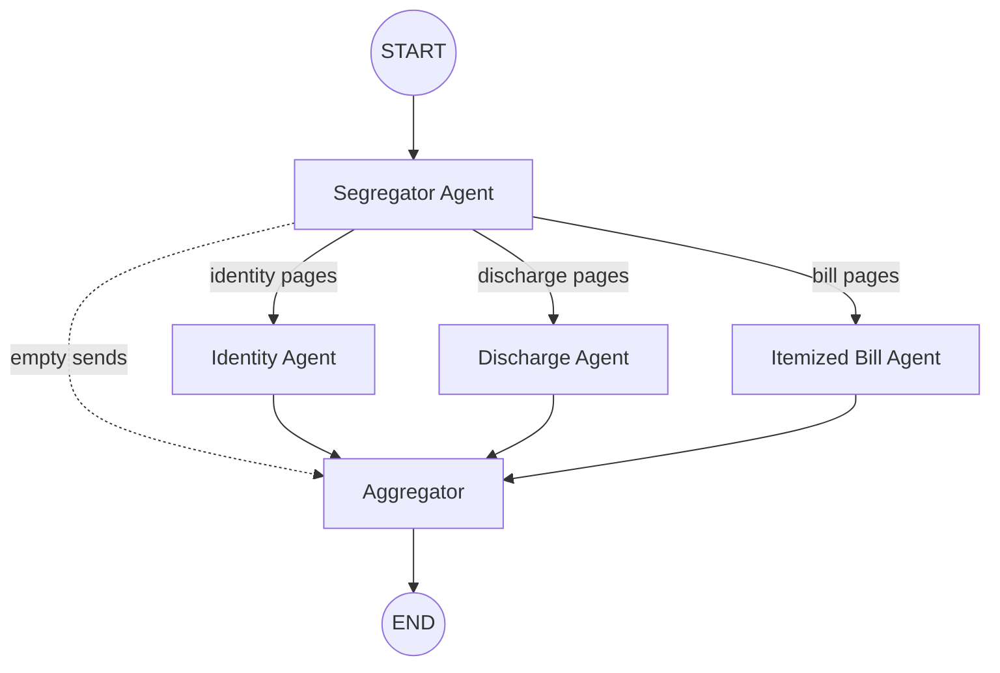

# Document Processing Pipeline

An AI-powered, multi-agent pipeline for extracting structured information from medical insurance claim PDFs. Built with **LangGraph**, **FastAPI**, **Google Gemini** (Vision), and **OpenRouter/Qwen** (Text).

## System Architecture

The pipeline processes documents in a single shot using a fan-out/fan-in Graph DAG approach to minimize LLM calls, reduce latency, and avoid rate limits:



1. **PDF Rendering**: Pages are converted to fast, lightweight JPEGs using PyMuPDF.
2. **Segregator**: A single Gemini vision call classifies *all pages simultaneously* into 9 medical document categories.
3. **Extraction Agents**: Parallel agents process their grouped pages. Each agent makes two calls:
   - Gemini Vision: Transcribes all its pages to clean Markdown.
   - Qwen Text: Extracts free-form structured JSON from the Markdown.
4. **Aggregator**: Consolidates results.

## Requirements

- Python 3.10+
- A Google AI Studio API Key
- An OpenRouter API Key

## Local Setup

1. **Clone & Environment**
   ```bash
   python -m venv .venv
   source .venv/bin/activate
   pip install -r requirements.txt
   ```

2. **Configuration**
   Copy the example `.env` file and fill in your keys:
   ```bash
   cp .env.example .env
   # Edit .env with your keys
   ```

## Running the API

Start the FastAPI development server:

```bash
fastapi dev main.py
# Or using uvicorn directly:
# uvicorn main:app --reload
```

The API will be available at `http://localhost:8000`. You can view the interactive Swagger docs at `http://localhost:8000/docs`.

## API Usage Example

**Endpoint:** `POST /api/process`  
Accepts a generic `claim_id` and the `file` itself via multipart form data.

```bash
curl -X POST http://localhost:8000/api/process \
  -F "claim_id=CLM-123456" \
  -F "file=@/path/to/your/document.pdf"
```

## Testing

The project includes an end-to-end testing suite that performs real LLM calls against the pipeline. 

> **Note:** These tests use real API calls. It will take a few minutes and consume a small amount of your API quota.

```bash
# Run unit & validation tests (no external LLM calls)
pytest tests/ -k "not real_pdf" -v

# Run the full end-to-end pipeline test
pytest tests/test_api.py::test_full_pipeline_real_pdf -v -s
```